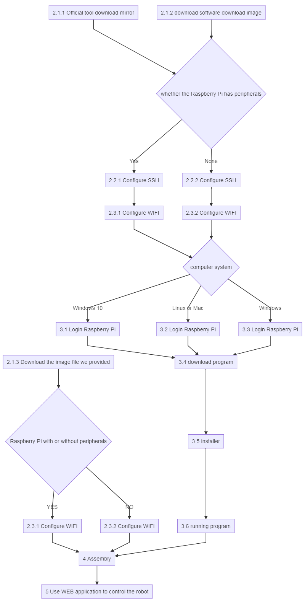
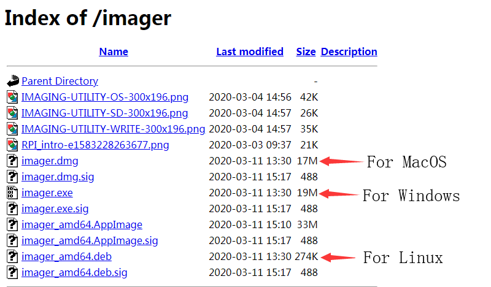
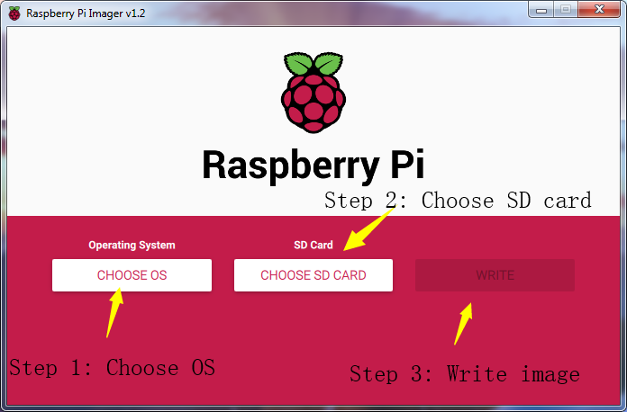
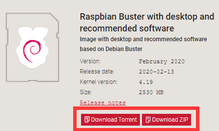
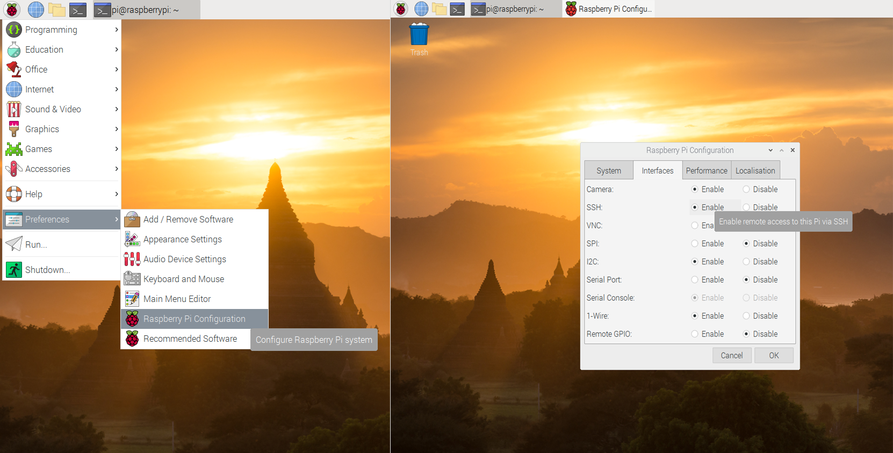
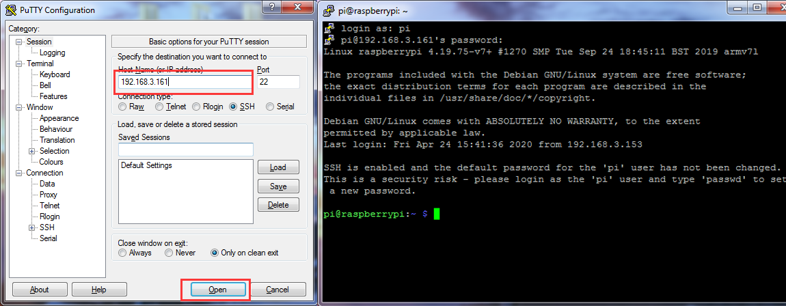
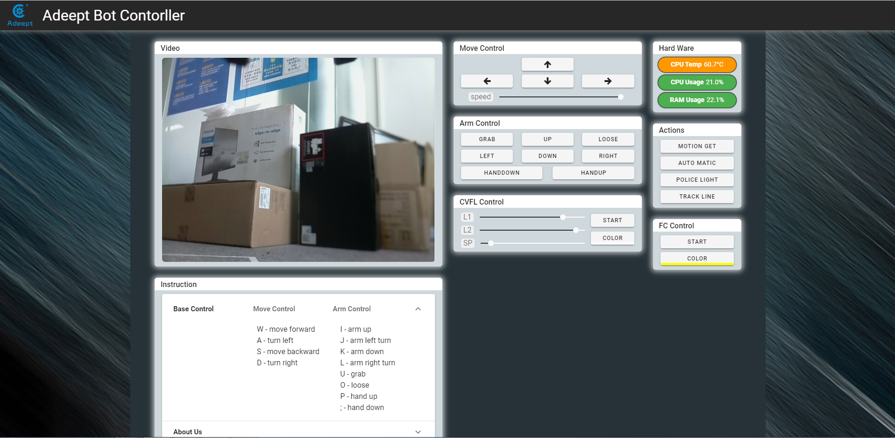

[RobotName]: Adeept_Rasptank
[RobotURL]: https://github.com/adeept/adeept_rasptank
[RobotGit]: https://github.com/adeept/adeept_rasptank.git
[Official Raspberry Pi website]: https://www.raspberrypi.org/downloads/
[Image file for the Raspberry Pi Robot]: https://adeept-my.sharepoint.com/personal/tomsun_adeept_onmicrosoft_com/_layouts/15/onedrive.aspx?id=%2Fpersonal%2Ftomsun%5Fadeept%5Fonmicrosoft%5Fcom%2FDocuments%2FadeeptRaspTank&amp;originalPath=aHR0cHM6Ly9hZGVlcHQtbXkuc2hhcmVwb2ludC5jb20vOmY6L2cvcGVyc29uYWwvdG9tc3VuX2FkZWVwdF9vbm1pY3Jvc29mdF9jb20vRXZCZmhES1dJVEJLb1ZLejFJTThta01CaWc5SHRiZG9sMXdLQU83WTk5cFJWdz9ydGltZT1rUWxJeE9EMjEwZw
[Official website]: https://www.adeept.com/
[GitHub]: https://github.com/adeept/adeept_rasptank/
[Documentation for structure assembly]: https://www.adeept.com/learn/
Getting Started with Raspberry Pi Robot and Python 
----
* [Getting Started with Raspberry Pi Robot and Python](#getting-started-with-raspberry-pi-robot-and-python)
    * [1. Premise](#1-premise)
       * [1.1 STEAM and Raspberry Pi](#11-steam-and-raspberry-pi)
       * [1.2 About the Documentation](#12-about-the-documentation)
    * [2. Getting to Use the Raspberry Pi](#2-getting-to-use-the-raspberry-pi)
       * [2.1 Write the Raspberry Pi image to an SD card](#21-write-the-raspberry-pi-image-to-an-sd-card)
          * [2.1.1 Method A: Write 'Raspbian' to the SD card by Raspberry Pi Imager](#211-method-a-write-raspbian-to-the-sd-card-by-raspberry-pi-imager)
          * [2.1.2 Method B: Download the image file Raspbian and write it to the SD card manually](#212-method-b-download-the-image-file-raspbian-and-write-it-to-the-sd-card-manually)
          * [2.1.3 Method C: Manually download the image file provided by us and write it to the SD card (not recommended)](#213-method-c-manually-download-the-image-file-provided-by-us-and-write-it-to-the-sd-card-not-recommended)
       * [2.2 Enable SSH Server of Raspberry Pi](#22-enable-ssh-server-of-raspberry-pi)
          * [2.2.1 Method A: Enable SSH with peripherals](#221-method-a-enable-ssh-with-peripherals)
          * [2.2.2 Method A: Enable SSH without peripherals](#222-method-a-enable-ssh-without-peripherals)
       * [2.3 Configure WiFi on Raspberry Pi](#23-configure-wifi-on-raspberry-pi)
          * [2.3.1 Method A: WiFi connection with peripherals](#231-method-a-wifi-connection-with-peripherals)
          * [2.3.2 Method A: WiFi connection without peripherals](#232-method-a-wifi-connection-without-peripherals)
    * [3. Software Installation &amp; Operation on Raspberry Pi](#3-software-installation--operation-on-raspberry-pi)
       * [3.1 Log into Raspberry Pi (Windows 10)](#31-log-into-raspberry-pi-windows-10)
       * [3.2 Log into Raspberry Pi (Linux or Mac OS)](#32-log-into-raspberry-pi-linux-or-mac-os)
       * [3.3 Log into Raspberry Pi (Windows)](#33-log-into-raspberry-pi-windows)
       * [3.4 Download Program of the Raspberry Pi Robot](#34-download-program-of-the-raspberry-pi-robot)
       * [3.5 Install Corresponding Dependent Libraries](#35-install-corresponding-dependent-libraries)
       * [3.6 Run the Raspberry Pi Robot's Program](#36-run-the-raspberry-pi-robots-program)
    * [4. Precautions for Structure Assembly](#4-precautions-for-structure-assembly)
          * [4.1 Documentation for structure assembly](#41-documentation-for-structure-assembly)
          * [4.2 Precautions for Structure Assembly](#42-precautions-for-structure-assembly)
    * [5. Controlling Robot via WEB App](#5-controlling-robot-via-web-app)
    * [6. Q&amp;A](#6-qa)


## 1. Premise
### 1.1 STEAM and Raspberry Pi
STEAM stands for Science, Technology, Engineering, Arts and Mathematics. It's a type of transdisciplinary education idea focused on practice. 
As a board designed for computer programming education, Raspberry Pi has lots of advantages over other robot development boards. Therefore, Raspberry Pi is used for function control of the robot. 

### 1.2 About the Documentation 
This documentation is for software installation and operation guide for the Python robot product. It describes every detail of the whole process of fulfilling the robot project by Python and Raspberry Pi from scratch as well as some precautions. Hope you can get started with the Raspberry Pi robot on Python and make more creations with this documentation.   




## 2. Getting to Use the Raspberry Pi

### 2.1 Write the Raspberry Pi image to an SD card 


#### 2.1.1 Method A: Write 'Raspbian' to the SD card by `Raspberry Pi Imager`
`Raspberry Pi Imager` is an image writing tool to SD card developed by the Raspberry Pi Organization. It comes with many versions working on different systems and it's quite easy to use; all you need is choose the operating system and SD card, Raspberry Pi Imager will download the corresponding image file for the system and install it to the SD card.

**Step-by-Step Overview**  

1. Prepare an SD card (16G or larger) and an SD card reader
2. Download the `Raspberry Pi Imager` on the official website [Official Raspberry Pi website](https://www.raspberrypi.org/downloads/ )
    - [Raspberry Pi Imager for Windows](https://downloads.raspberrypi.org/imager/imager.exe "Click here to download Raspberry Pi Imager for Windows)
    - [Raspberry Pi Imager for macOS](https://downloads.raspberrypi.org/imager/imager.dmg "Click here to download Raspberry Pi Imager for macOS")
    - [Raspberry Pi Imager for Ubuntu](https://downloads.raspberrypi.org/imager/imager_amd64.deb "Click here to download Raspberry Pi Imager for Ubuntu")
3. Install the `Raspberry Pi Imager`
4. Write the operating system for Raspberry Pi to the SD card with `Raspberry Pi Imager` `Raspbian Full - A port of Debian with desktop and recommended application`  
5. Leave the SD card connected after writing is completed, we'll use for configuring SSH and WiFi connection later.

**Detailed Steps:**  

- Open a web browser on your computer, go to the Raspberry Pi website [Official Raspberry Pi website](https://www.raspberrypi.org/downloads/ ), find and download the `Raspberry Pi Imager` for your computer OS, or click on the links above for the corresponding system to directly download and install.   

  

- Insert the SD card into the card reader, connect the card reader and your computer.   

- Run the `Raspberry Pi Imager`, select `CHOOSE OS` -> `Raspbian(other)` -> `Raspbian Full - A port of Debian with desktop and recommended applications`. 

- Click on `CHOOSE SD CARD` for the SD card to write the `Raspbian Full`, please be noted that the image writing will automatically delete all files on the SD card if any.  

- Click on `WRITE`, wait for the writing. The `Raspberry Pi Imager` needs to download the `Raspbian` image file during the process. You can download the file following the step in **2.1.2**.  

  

- Do not remove the SD card connected when writing is completed, we'll use for configuring SSH and WiFi connection later. Otherwise, if you remove the card, insert it into the Raspberry Pi and boot, WiFi configuration without any peripherals may fail in the following process.


#### 2.1.2 Method B: Download the image file `Raspbian` and write it to the SD card manually
Since the image file is downloaded with the `Raspberry Pi Imager` in **2.1.1**, it can take a long time due to a slow network in some places. You may then manually download the image file `Raspbian` and write it to the SD card with th `Raspberry Pi Imager`.  

**Step-by-Step Overview**

1. Prepare an SD card (16G or larger) and an SD card reader
2. Download the `Raspberry Pi Imager` on the official website [Official Raspberry Pi website](https://www.raspberrypi.org/downloads/ )
    - [Raspberry Pi Imager for Windows](https://downloads.raspberrypi.org/imager/imager.exe "Click here to download Raspberry Pi Imager for Windows)
    - [Raspberry Pi Imager for macOS](https://downloads.raspberrypi.org/imager/imager.dmg "Click here to download Raspberry Pi Imager for macOS")
    - [Raspberry Pi Imager for Ubuntu](https://downloads.raspberrypi.org/imager/imager_amd64.deb "Click here to download Raspberry Pi Imager for Ubuntu")
3. Install the `Raspberry Pi Imager`
4. Download the image file `Raspbian`
    - Torrent file: 
    [Raspbian - Raspbian Buster with desktop and recommended software](https://downloads.raspberrypi.org/raspbian_full_latest.torrent "Link to download the torrent file for image")
    - Zip file: [Raspbian - Raspbian Buster with desktop and recommended software](https://downloads.raspberrypi.org/raspbian_full_latest "Link to download the zip file for image")
5. Unzip the file, be noted that the path should be in English for the `.img` file extracted, no special characters allowed.
6. Write the image file `Raspbian` downloaded to the SD card with `Raspberry Pi Imager`
7. Leave the SD card connected after writing is completed, we'll use for configuring SSH and WiFi connection later.

**Detailed Steps:**

- Open a web browser on your computer, go to the Raspberry Pi website[Official Raspberry Pi website], find and download the `Raspberry Pi Imager` for your computer OS, or click on the links above for the corresponding system to directly download and install.   

  

- On the Raspberry Pi website [Official Raspberry Pi website](https://www.raspberrypi.org/downloads/ ), select through `Downloads` -> `Raspbian` -> `Raspbian Buster with desktop and recommended software`, and click on the torrent or zip file to download. Unzip the file after download, be noted that the path should be in English for the `.img` file extracted, no special characters allowed; otherwise `Raspberry Pi Imager` may not open the `.img` file. It's recommended to save the `.img` file to the root directory of the `C:\` or `D:\` disk, **but do not save `.img` on the SD card**.  

  

- Insert the SD card into the card reader, connect the card reader and your computer.   

- Run the `Raspberry Pi Imager`, select `CHOOSE OS`, and then `Use custom` to find the `.img` extracted, click `Open`. 

- Select `CHOOSE SD CARD` for the SD card to write the `Raspbian`, please be noted that the image writing will automatically delete all files on the SD card if any.  

- Click on `WRITE`, wait for the writing. 

  

- Do not remove the SD card connected when writing is completed, we'll use for configuring SSH and WiFi connection later. Otherwise, if you remove the card, insert it into the Raspberry Pi and boot it up, WiFi configuration without any peripherals may fail in the following process.  

#### 2.1.3 Method C: Manually download the image file provided by us and write it to the SD card (not recommended)
The Raspbian image file downloaded in **2.1.1** and **2.1.2** is the official source with some preinstalled software. To operate the robot, you may need many dependent libraries. Though we provide the simple script to install them (see details later), failure can happen during installation if the library is not the latest version. Therefore, despite we provide the downloading of the Raspbian image file, it may happen that our image file and the dependent libraries are not most updated versions. Please only use when you encounter the most troublesome situation.   
**Step-by-Step Overview**  

1. Prepare an SD card (16G or larger) and an SD card reader
2. Download the `Raspberry Pi Imager` from the official website [Official Raspberry Pi website](https://www.raspberrypi.org/downloads/ )
    - [Raspberry Pi Imager for Windows](https://downloads.raspberrypi.org/imager/imager.exe "Click here to download Raspberry Pi Imager for Windows")
    - [Raspberry Pi Imager for macOS](https://downloads.raspberrypi.org/imager/imager.dmg "Click here to download Raspberry Pi Imager for macOS")
    - [Raspberry Pi Imager for Ubuntu](https://downloads.raspberrypi.org/imager/imager_amd64.deb "Click here to download Raspberry Pi Imager for Ubuntu")
3. Install the `Raspberry Pi Imager`
4. Download the image file `Raspbian`
    - [Image file for the Raspberry Pi Robot](https://adeept-my.sharepoint.com/personal/tomsun_adeept_onmicrosoft_com/_layouts/15/onedrive.aspx?id=%2Fpersonal%2Ftomsun%5Fadeept%5Fonmicrosoft%5Fcom%2FDocuments%2FadeeptRaspTank&originalPath=aHR0cHM6Ly9hZGVlcHQtbXkuc2hhcmVwb2ludC5jb20vOmY6L2cvcGVyc29uYWwvdG9tc3VuX2FkZWVwdF9vbm1pY3Jvc29mdF9jb20vRXZCZmhES1dJVEJLb1ZLejFJTThta01CaWc5SHRiZG9sMXdLQU83WTk5cFJWdz9ydGltZT1rUWxJeE9EMjEwZw)
5. Unzip the file, be noted that the path should be in English for the `.img` file extracted, no special characters allowed.
6. Write the image file `Raspbian` downloaded to the SD card with `Raspberry Pi Imager`
7. Leave the SD card connected after writing is completed, we'll use for configuring SSH and WiFi connection later.

**Detailed Steps:**  

- Open a web browser on your computer, go to the Raspberry Pi website [Official Raspberry Pi website](https://www.raspberrypi.org/downloads/ ), find and download the `Raspberry Pi Imager` for your computer OS, or click on the links above for the corresponding system to directly download and install.  

  

- Go to our [official website](https://www.adeept.com/ ), find and download the image file - [Image file for the Raspberry Pi Robot](https://adeept-my.sharepoint.com/personal/tomsun_adeept_onmicrosoft_com/_layouts/15/onedrive.aspx?id=%2Fpersonal%2Ftomsun%5Fadeept%5Fonmicrosoft%5Fcom%2FDocuments%2FadeeptRaspTank&originalPath=aHR0cHM6Ly9hZGVlcHQtbXkuc2hhcmVwb2ludC5jb20vOmY6L2cvcGVyc29uYWwvdG9tc3VuX2FkZWVwdF9vbm1pY3Jvc29mdF9jb20vRXZCZmhES1dJVEJLb1ZLejFJTThta01CaWc5SHRiZG9sMXdLQU83WTk5cFJWdz9ydGltZT1rUWxJeE9EMjEwZw). Unzip the file, be noted that the path should be in English for the `.img` file extracted, no special characters allowed. otherwise `Raspberry Pi Imager` may not open the `.img` file. It's recommended to save the `.img` file to the root directory of the `C:\` or `D:\` disk, **but do not save `.img` on the SD card**.  

- Insert the SD card into the card reader, connect the card reader and your computer.   

- Run the `Raspberry Pi Imager`, select `CHOOSE OS`, and then `Use custom` to find the `.img` extracted, click `Open`.

- Select `CHOOSE SD CARD` for the SD card to write the `Raspbian`, please be noted that the image writing will automatically delete all files on the SD card if any.  

- Click on `WRITE`, wait for the writing.  

  

- Do not remove the SD card connected when writing is completed, we'll use for configuring SSH and WiFi connection later. Otherwise, if you remove the card, insert it into the Raspberry Pi and boot it up, WiFi configuration without any peripherals may fail in the following process.  

### 2.2 Enable SSH Server of Raspberry Pi 
- By SSH (Secure Shell) server, you can use the command line of Raspberry Pi remotely on another device. In the subsequent operation and when using the Raspberry Pi, you don't have to connect a mouse, keyboard, or monitor to it, but simply control it on a computer in the same LAN.   
- As of the November 2016 release, Raspbian has the SSH server disabled by default. You will have to enable it manually.  
- The method to enable the SSH in this documentation can be referred to the Raspberry Pi official website [SSH(Secure Shell)](https://www.raspberrypi.org/documentation/remote-access/ssh/)  

#### 2.2.1 Method A: Enable SSH with peripherals
- If you've connected a mouse, keyboard, or monitor to the Raspberry Pi, follow these steps to enable SSH.   

    1. Remove the SD card from the computer, insert it to the Raspberry Pi, connect a mouse, keyboard, and monitor to the Raspberry Pi, boot it up.   
    2. Go to `Preferences` menu, select `Raspberry Pi Configuration`.
    3. Go to `Interfaces` option. 
    4. Select `Enable` next to `SSH`.
    5. Click on `OK`.  
    
    

#### 2.2.2 Method A: Enable SSH without peripherals
- If you haven't connected any monitor to the Raspberry Pi, follow these steps to enable SSH.  

    1. Do not remove the SD card after `Raspberry Pi Imager` writes the image file.  

    2. Create a file named `ssh` under any directory, without any extension name. You may create a `ssh.txt` and delete the `.txt` (make sure under Folder Options the box of Hide extensions for known file types is unchecked. Then you have an `ssh` file without extension name.   

    3. Copy the `ssh` file and paste to the root directory of the SD card. The Raspberry Pi will auto search for the `ssh` file when booting, and enable SSH if the file is found. You only need to copy for one time because the Raspberry Pi then will automatically enable SSH at every boot.   

    4. Do not remove the SD card if you need to configure WiFi. 

### 2.3 Configure WiFi on Raspberry Pi 
There are many ways to connect WiFi for Raspberry Pi. Two methods are provided in this documentation; you may visit the official Raspberry Pi website for more: [Wireless connectivity](https://www.raspberrypi.org/documentation/configuration/wireless/README.md).
#### 2.3.1 Method A: WiFi connection with peripherals 
- If you've connected a mouse, keyboard, or monitor to the Raspberry Pi, follow these steps to configure WiFi. 

    1. Remove the SD card from the computer, insert it to the Raspberry Pi, connect a mouse, keyboard, and monitor to the Raspberry Pi, boot it up.   
    2. Select the WiFi icon at the top right corner on the monitor, find the WiFi to connect and select.
    3. Type in the password for the WiFi, connect. 
    4. After it's connected successfully, the WiFi will be saved and the Raspberry Pi will auto connect for next boot, so you don't need to connect peripherals every time. 

#### 2.3.2 Method A: WiFi connection without peripherals 
- If you haven't connected any monitor to the Raspberry Pi, follow these steps to configure WiFi.  
- This method is based on the [official documentation](https://www.raspberrypi.org/documentation/configuration/wireless/headless.md)  

    1. Do not remove the SD card after `Raspberry Pi Imager` has written the image file. (This method works for the situation that the Raspbian image file has just been written to the SD card; if you've already plugged the SD card into the Raspberry Pi and got it rebooted after the image file being written, the configuration may fail.)  

    2. Create a file named `wpa_supplicant.conf` anywhere in your computer.   
    
    3. Open the file `wpa_supplicant.conf` created with Textbook, enter the following code:   

    ```
    ctrl_interface=DIR=/var/run/wpa_supplicant GROUP=netdev
    update_config=1
    country=Insert country code here
    network={
     ssid="Name of your WiFi"
     psk="Password for your WiFi"
    }
    ```

    4. TYpe in your own information for `Insert country code here`, `Name of your WiFi`, and `Password for your WiFi`. Pay attention to the capitalization. Refer to the example below:   

    ```
    ctrl_interface=DIR=/var/run/wpa_supplicant GROUP=netdev
    update_config=1
    country=US
    network={
     ssid="MyName"
     psk="12345678"
    }
    ```

    5. Save and exit. Copy the `wpa_supplicant.conf` to the root directory of the SD card.   

    6. If you've alreay copied the file `ssh` to the SD card as instructed in **2.2**, then both the WiFi and SSH settings without peripherals are done. You may remove the SD card, insert it into the Raspberry Pi, and boot it up.   
    
    7. For more about the file `wpa_supplicant.conf`, refer to the official documentation [WIRELESS-CLI](https://www.raspberrypi.org/documentation/configuration/wireless/wireless-cli.md)

## 3. Software Installation & Operation on Raspberry Pi 
- If you followed the steps in **2.2.1** and **2.3.1** for SSH and WiFi configuration, you may remove the peripherals now and use SSH to remotely control the Raspberry Pi later on.   

- If you followed the steps in **2.2.2** and **2.3.2**, you may now insert the SD card into the Raspberry Pi and boot it up. The Raspberry Pi will auto boot and connect WiFi when powered on, with no need of peripherals.

- Some steps mentioned below are based on the official Raspberry Pi documentation [SSH](https://www.raspberrypi.org/documentation/remote-access/ssh/).  

- For power supply of the Raspberry Pi, refer to the official documentation[Power supply](https://www.raspberrypi.org/documentation/hardware/raspberrypi/power/README.md).

- The Robot HAT board of the Adeept Raspberry Pi Robot can supply power for the Raspberry Pi via GPIO port. However, since it may take a long time to install software on the Raspberry Pi, it's not recommended to supply with the batteries during this process. You may skip the installation of the Robot HAT board or camera during software installation; though you need to make sure the driver board and camera for the Raspberry Pi when it's ready yto run the software installed, or a program error will occur.  

### 3.1 Log into Raspberry Pi (Windows 10)
- For Windows 10, SSH is built in the versions after October 2018, so you don't need any third-party software.   

- For lower versions of Windows OS, SSH is not built in, and you may log into the Raspberry Pi by referring to the official documentation [SSH using Windows](https://www.raspberrypi.org/documentation/remote-access/ssh/windows.md). 

- Before connecting the Raspberry Pi via SSH, you need to know the IP address of the Raspberry Pi. Check the Management interface for your router, or download the app `Network Scanner` -> search for a device named `RASPBERRY` or `Raspberry Pi Foundation` to get the IP address.  

- For other methods of obtaining the IP address of Raspberry Pi, refer to the official documentation [IP Address](https://www.raspberrypi.org/documentation/remote-access/ip-address.md)  

- Press the keys <kbd>win</kbd>+<kbd>R</kbd>, type in `cmd`, and press <kbd>enter</kbd>.

- The default user is `pi`, and the password is `raspberry`. 

- Type in `ssh pi@<IP>` in the command line, replace the `<IP>` with the IP address of your Raspberry Pi, as shown below:  

    >ssh pi@192.168.3.161  

- Press Enter key and a prompt will appear: `Are you sure you want to continue connecting (yes/no)?`  

- Type in `yes`, press Enter and it'll show `pi@192.168.3.161's password:`, type in the initial password of the Raspberry Pi, `raspberry` (pay attention to capitalization). There's no change on the screen when you're typing in, but it doesn't mean you're not entering the information. Press <kbd>enter</kbd> after you finish typing in. 

- So now you've logged into the Raspberry Pi.   


### 3.2 Log into Raspberry Pi (Linux or Mac OS)

- Before connecting the Raspberry Pi via SSH, you need to know the IP address of the Raspberry Pi. Check the Management interface for your router, or download the app `Network Scanner` -> search for a device named `RASPBERRY` or `Raspberry Pi Foundation` to get the IP address.  

- For other methods of obtaining the IP address of Raspberry Pi, refer to the official documentation [IP Address](https://www.raspberrypi.org/documentation/remote-access/ip-address.md)  

- Open the terminal window (or command line)   

- The default user is `pi`, and the password is `raspberry`. 

- Type in `ssh pi@<IP>` in the command line, replace `<IP>` with the IP address of your Raspberry Pi as shown below:   

    >ssh pi@192.168.3.161  

- Press Enter key and a prompt will appear: `Are you sure you want to continue connecting (yes/no)?`  

- Type in `yes`, press Enter and it'll show `pi@192.168.3.161's password:`, type in the initial password of the Raspberry Pi, `raspberry` (pay attention to capitalization). There's no change on the screen when you're typing in, but it doesn't mean you're not entering the information. Press <kbd>enter</kbd> after you finish typing in.   

- So now you've logged into the Raspberry Pi.   

### 3.3 Log into Raspberry Pi (Windows)
- For lower versions of Windows OS, SSH is not built in, and you may log into the Raspberry Pi by referring to the official documentation Raspberry Pi[SSH using Windows](https://www.raspberrypi.org/documentation/remote-access/ssh/windows.md).  
- Before connecting the Raspberry Pi via SSH, you need to know the IP address of the Raspberry Pi. Check the Management interface for your router, or download the app `Network Scanner` -> search for a device named `RASPBERRY` or `Raspberry Pi Foundation` to get the IP address.  
- For other methods of obtaining the IP address of Raspberry Pi, refer to the official documentation [IP Address](https://www.raspberrypi.org/documentation/remote-access/ip-address.md)  
- You may need to download the `PuTTY` version for your OS and log into Raspberry Pi with the tool. [Click here to download PuTTY](https://www.chiark.greenend.org.uk/~sgtatham/putty/latest.html)  
- Run `PuTTY`, type in the IP address of Raspberry Pi for `Host Name`, and click <kbd>Open</kbd>.  
- If a prompt of `Network error: Connection timed out` appears, possibly you've entered an incorrect IP address.   
- When the connection works you will see the security warning shown below. You can safely ignore it, and click the 'Yes' button. You will only see this warning the first time PuTTY connects to a Raspberry Pi that it has not seen before.  
- You will now see the usual login prompt. Log in with the same username and password you would use on the Pi itself. The default login for Raspbian is `pi` with the password `raspberry`.  
- You should now have the Raspberry Pi prompt which will be identical to the one found on the Raspberry Pi itself.  



### 3.4 Download Program of the Raspberry Pi Robot 

- The code for the robot product has been uploaded to [GitHub], you may need to download to your Raspberry Pi and install the corresponding dependent libraries to run the program.   

- In the previous section you've logged into the Raspberry Pi, and here type in the follow command in the terminal window:

    >sudo git clone https://github.com/adeept/adeept_rasptank.git

- Press <kbd>enter</kbd> to start downloading the program of the robot from GitHub. It may take some time, please wait until it's done.  

### 3.5 Install Corresponding Dependent Libraries 
- Follow the steps below to install the libraries if you wrote the image file to the SD card based on **2.1.1 Write 'Raspbian' to the SD card by `Raspberry Pi Imager`** and **2.1.2 Download the image file `Raspbian` and write it to the SD card manually**.   

- But you should **skip this section** if you wrote the image file to the SD card based on **2.1.3 Manually download the image file provided by us and write it to the SD card**; refer to **2.4.5** for configuration of auto start program. 

- Here a script is provided for installing all dependent libraries needed and configuration of starting the camera and other auto start programs.   

- Type in the code below in the terminal window to run the dependent libraries for the script `setup.py`:  

    >sudo python3 adeept_rasptank/setup.py

- Press <kbd>enter</kbd> and the script will auto run. This may take minutes or hours, depending on the network status. Please wait until it's done.  

- After installation is completed, the following prompts will appear: 

    >The program in Raspberry Pi has been installed, disconnected and restarted.  
    >You can now power off the Raspberry Pi to install the camera and driver board (Robot HAT). After turning on again, the Raspberry Pi will automatically run the program to set the servos port signal to turn the servos to the middle position, which is convenient for mechanical assembly.

- When installation is completed, the Raspberry Pi will automatically disconnect SSH and reboot. If you used puTTy to connect the Raspberry Pi, there can be an error prompt like `Network error:Software caused connection abort`. You can just ignore and close it.  

### 3.6 Run the Raspberry Pi Robot's Program

- Raspberry Pi auto runs the program for the robot when rebooting every time, which is the part `[RobotName]/server/webServer.py` (replace `[RobotName]` for the name of the folder for your robot product's program). However, if the Raspberry Pi camera or RobotHAT is not connected, the `webServer.py` can't run well. It makes sense because the robot's program needs the camera and the chipset PCA9685. RobotHAT controls servo with PCA9685; the Raspberry Pi communicates with PCA9685 via I2C; so if Robot HAT is not connected to Raspberry Pi, a program error will occur when instantiating dependent libraries for PCA9685 due to communication failure. 

- Power off the Raspberry Pi, connect camera module and RobotHAT, reboot it up and now `webServer.py` can run.   

- Generally you don't need to manually run `webServer.py` since it's auto run by Raspberry Pi at every boot.   

- Open a web browser (Google Chrome for example), in the address bar type in the IP address of the Raspberry Pi, add `:5000` to the end as shown below, and press <kbd>enter</kbd> to redirect to the webpage of the Raspberry Pi:   

    >http://192.168.3.161:5000/

- If it fails to enter the page, log into the Raspberry Pi via SSH, type in the command below to end the program auto run at boot to release resources, or else issues like camera initialization failure or occupied ports.   

    >sudo killall python3

- Type in the command below to run `webServer.py`: 

    >sudo python3 adeept_rasptank/server/webServer.py  

- Check whether there's any error and solve them based on instructions in the Q&A section below.   

## 4. Precautions for Structure Assembly
#### 4.1 Documentation for structure assembly
- [Documentation for structure assembly](https://www.adeept.com/learn)

#### 4.2 Precautions for Structure Assembly
- Since many servos are used in the product, the servo installation is critical for the robot. Before installing the rocker arm to the servo, you need to connect the servo to power and make the servo shaft rotate to the central position, so the rocker arm installed at the designated degree will be in the central position.   

- Generally Raspberry Pi will auto run `webServer.py` when booting, when `webServer.py` will control all the ports connected to servos to send a signal of rotating to the central position. When assembling the servo, you can connect it to any servo port anytime. After connecting the servo to the port, the gears will rotate to the central position; assemble the rocker arm to the servo, disconnect the servo from the port, and insert more servos to repeat rocker arm assembly (all servos will be in the central position).  

- When the servo is connected to power, try moving the rocker arm. If it can't be moved, it indicates the program for the servo works; otherwise there's error for the servo program. Run the line `[RobotName]/initPosServos.py` (replace `[RobotName]` with the folder name of your robot's program) to make the servo rotate to the central position.  

- When booting (it may take 30-50s), it takes a while for the Raspberry Pi to control PCA9685 to set signal of all servo ports for central position rotating. 

## 5. Controlling Robot via WEB App

- The WEB app is developed for common users to control the robot in an easier way. It's convenient to use WEB app; you may use it to wirelessly control the robot on any device with a web browser (Google Chrome was used for testing).  

- Generally Raspberry Pi will auto run `webServer.py` when booting and establish a web server in the LAN. You may then use any other computer, mobile or tablet in the same LAN to visit the webpage and control the robot.

- How to tell whether the robot has run the `webServer.py` or not: If the WS2812-LED lights up with the breathing effect, it means the robot has booted and runs the program automatically.    

- If the program is not run when the robot is booted, try to connect Raspberry Pi via SSH, manually run `webServer.py` with code and check the errors. Refer to the **Q&A** below or email us for help (before manually running `webServer.py`, you need to end the program possibly auto run in the backend to release resources. 

    > sudo killall python3  
    > sudo python3 [RobotName]/server/webServer.py

- If the `webServer.py` is auto run successfully, open a web browser (here Google Chrome), type in the IP address of the Raspberry Pi, with `:5000` added to the end, and go to the next step, as shown below:   

    > 192.168.3.161:5000  

- If no image is displayed, try manual running `webServer.py` as described in the step above.  

- If image is shown, you can control the robot to move now. You may check the description for keyboard shortcuts `Instruction` at the bottom and control the robot based on its general functions with the keyboard.   

- `Video` window shows the image captured by the robot's camera in real time.  

- `Move Control` window is to control the basic movements of the robot.   

- `Arm Control` window controls the servo movement. 
    - <kbd>GRAB</kbd>   <kbd>LOOSE</kbd>: Control the claws of the robotic arm to open and close
    - <kbd>HANDUP</kbd> <kbd>HANDDOWN</kbd>: Control the robotic arm to move up and down 
    - <kbd>LEFT</kbd>   <kbd>RIGHT</kbd>: Control the claws rotation of the robotic arm 

- `CVFL Control` window is to control the visual line following function of the robot. Here only an overview for the function is described; more details will be provided in the OpenCV section: 
    - <kbd>START</kbd>: Enable or disable the visual line following function. 
    - <kbd>COLOR</kbd>: Switch between white and black line following. By default the robot follows white lines; click the button to switch to black line following.
    - The line following function analyzes two pixels in parallel and utilizes the information detected; the positions of these two pixels are `L1` and `L2`.
    - `SP` is the threshold of the turning command based on the visual analysis results. A bigger `SP` value means a big deviation; though a particularly small `SP` value may stop the robot from moving as it can't aim the target and find the direction. 
    - When the visual line following function is enabled, the video screen will automatically become binarized results, making the visual analysis clearer.  

- `Hard Ware` window displays CPU temperature, CPU occupancy rate, and memory usage of the Raspberry Pi.  

- `Actions`window control unique functions of the robot: 
    - <kbd>MOTION GET</kbd>: Motion detection function based on OpenCV. When objects move in the view of the camera, the program will circle the part in the `Video` window, and the LED light on the robot will show respective changes. 
    - <kbd>AUTO MATIC</kbd>: Obstacle avoidance function based on ultrasonic. When the ultrasonic module on the robot detects an obstacle, it will automatically turn left, and take a step backward before turning if it's too close to the obstacle. 
    - <kbd>POLICE LIGHT</kbd>: WS2812-LED light control based on multithreading. It makes the WS2812-LED light on the robot blink red and blue alternately.
    - <kbd>TRACK LINE</kbd>: Line tracking function by using the 3-channel infrared module. By default it tracks black lines on a white surface (a white background that reflects infrared, and 1-cm wide black lines that do not reflects infrared). Performance of the line tracking varies from surface and line materials as well as the height of the robot chassis; you may need a cross screwdriver to adjust the potentiometer on the line tracking module.  

- `FC Control` window controls the color lock function of the robot:
    - <kbd>START</kbd>: Enable or disable color searching and tracking function.
    - <kbd>COLOR</kbd>: Select the color to track.
    - When the function is on, the robot will automatically lock one particular color in the camera view. By default it tracks bright yellow objects. You can change the color as you want. When an object is locked, the LED on the robot will turn orange. As the robot's head can only move up and down, the program does not involve tracking colors horizontally. If you have interest in this part, you may add the motor control based on the openCV section to realize effect.   



## 6. Q&A

- Where to find the IP address of the Raspberry Pi?

    > - Before connecting the Raspberry Pi via SSH, you need to know the IP address of the Raspberry Pi. Check the Management interface for your router, or download the app `Network Scanner` -> search for a device named `RASPBERRY` or `Raspberry Pi Foundation` to get the IP address.  

    > For other methods of obtaining the IP address of Raspberry Pi, refer to the official documentation [IP Address](https://www.raspberrypi.org/documentation/remote-access/ip-address.md) 

- Errors occur with `permission denied` prompt when I manually run `server.py` or `webServer.py`.

    > The Raspberry Pi needs the root permission to run the dependent libraries for WS2812 LED lights control.
    > You need to add `sudo` to the beginning of `server.py` or `webServer.py` to run the program. 
    > sudo python3 [PATH]/server.py
    > sudo python3 [PATH]/webServer.py

- I can't create the hotspot for the robot. 

    > You need to use the open source project create_ap to setup the robot's hotspot. Prior to use, disconnect WiFi network but DO NOT turn the WiFi module off, or the create_ap will show an error of hardware being blocked. 

- The servo rotates to an abnormal degree. 

    > Before assembling the rocker arm and servo, you need to make the servo gears rotate to the central position of its rotating range. Then assemble the rocker arm based on the angle instructed in the documentation. There can be a deviation of less than 9° due to the structure of the servo (number of teeth is 20 for the servo gears). For better performance, you may refer to the servo control documentation for initial degree adjustment by code. 

- The servo is shaking. 

    > Probably the servo reducing gear is broken. 

- Raspberry Pi can't boot. 

    > Remove all parts on the driver board. Only connect the board to Raspberry Pi and power supply, reboot. 

- "Remote side unexpectedly closed network connection" shows on a popup window. 

    > There can be error prompts during installation because the Raspberry Pi will auto reboot after the installation, which will disconnect the board. 

- Program crashes after double clicking on client.py or GUI.py.

    > Run the script by `python client.py` or `python GUI.py` in cmd and check the error reports.

- How to initialize the servo's angle?

    > If you've finished software installation on the Raspberry Pi, just boot it up and the servo will be initialized. 

- I can connect to the Raspberry Pi terminal via SSH \ Raspberry Pi failed to connect a WiFi.

    > The power supply methods will not influence control by SSH. Check whether you've created the file `wpa_supplicant.conf` for multiple times. If yes, that's problem causing SSH errors. 

- Can I supply the Robot HAT and Raspberry Pi via USB? 

    > A 2A output is required for a Raspberry Pi 3B, when at least 3A is needed for a Raspberry Pi 4. You can use the USB power for software installation and testing, but it's not suitable for high power module like servo or motor adjustment as it may result in low voltage. It's recommended to use battery for power here.

- After installation, the robot shows no response when booting. 

    > The `server.py` or `webServer.py` may not run due to some reasons. Try to manually run `server.py` or `webServer.py` and check whether there's any error prompt.

- The servo doesn't return to the central position when connected to the driver board. 

    > In general, the Raspberry Pi will auto run `webServer.py` when booting, and `webServer.py` will run and control the servo ports to send a signal of rotating to the central position. When assembling the servo, you can connect it to any servo port anytime. After connecting the servo to the port, the gears will rotate to the central position; assemble the rocker arm to the servo, disconnect the servo from the port, and insert more servos to repeat rocker arm assembly (all servos will be in the central position). 

    > When the servo is powered on, try moving the rocker arm. If it can't be moved, it indicates the program for the servo works; otherwise there's error for the servo program. Run the line `[RobotName]/initPosServos.py` (replace `[RobotName]` with the folder name of your robot's program) to make the servo rotate to the central position.  

    > When booting (it may take 30-50s), it takes a while for the Raspberry Pi to control PCA9685 to set signal of all servo ports for central position rotating. 

- “no cv2" error occurs when I manually run `server.py` or `webServer.py`. 

    > OpenCV is not installed correctly. Type in the command sudo pip3 install opencv-contrib-python in the Raspberry Pi to manually install OpenCV.